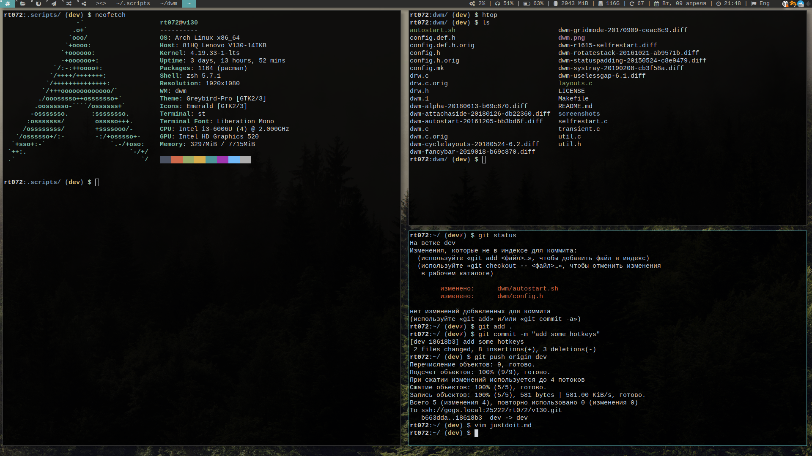
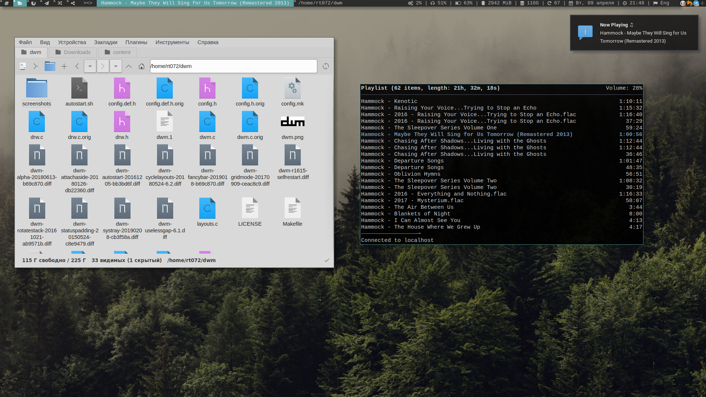

## dwm - dynamic window manager
*dwm is an extremely fast, small, and dynamic window manager for X.*


### Installation

```bash
$ make
$ sudo make install
$ make clean
```


### Configuration

The configuration of dwm is done by creating a custom config.h
and (re)compiling the source code.


### Screenshots
Desktop with terminals



File manager and terminal



* Taglist 
* Change tiling mode(button) 
* List open windows 
* System status  CPU Load, volume info(icon change when headphones plugged), battery info(when battery level change, icon change too), memory info, free space on SSD, how many updates available, calendar, time and keyboard layout.
* System tray 
* Notification system - Dunst 


### My Keybindings

The MODKEY is set to the `Super` key (`Windows` key)

| Keybinding | Action |
| :--- | :--- |
| `Alt + F2` | opens run launcher (dmenu is the run launcher but can be easily changed) |
| `MODKEY + Enter` | opens terminal (st is the terminal but can be easily changed) |
| `MODKEY + SHIFT + c` | closes window with focus |
| `MODKEY + SHIFT + q` | quits dwm |
| `MODKEY + j` | focus stack +1 (switches focus between windows in the stack) |
| `MODKEY + k` | focus stack -1 (switches focus between windows in the stack) |
| `MODKEY + SHIFT + j` | rotate stack +1 (rotates the windows in the stack) |
| `MODKEY + SHIFT + k` | rotate stack -1 (rotates the windows in the stack) |
| `MODKEY + h` | setmfact -0.05 (decreases window width) |
| `MODKEY + l` | setmfact +0.05 (increases window width) |
| `MODKEY + t` | tiling mode |
| `MODKEY + f` | floating mode |
| `MODKEY + m` | monocle mode |
| `MODKEY + g` | grid mode |


### Patches

1. alpha
2. attachaside
3. autostart
4. cyclelayouts
5. fancybar
6. gridmode
7. selfrestart
8. rotatestack
9. statuspadding
10. systray
11. uselessgap
