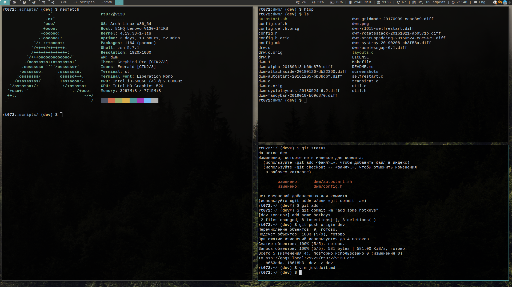
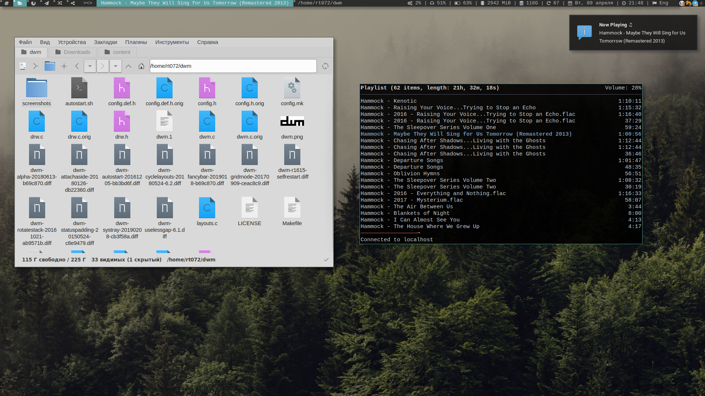

### dwm - dynamic window manager
*dwm is an extremely fast, small, and dynamic window manager for X.*

#### Installation

```bash
make
make install
```
#### Screenshots
Desktop 1



Desktop 2



* Taglist 
* Change tiling mode(button)
* List open windows 
* System status  CPU Load, volume info(icon change when headphones plugged), battery info(when battery level change, icon change too), memory info, free space on SSD, how many updates available, calendar, time.
* System tray 
